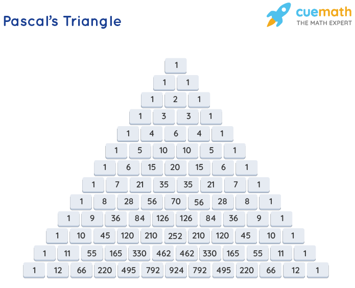

# 0x00. Pascal's Triangle
## What is Pascal's Triangle?
A pascal's triangle is an arrangement of numbers in a triangular array such that the numbers at the end of each row are 1 and the remaining numbers are the sum of the nearest two numbers in the above row. This concept is used widely in probability, combinatorics, and algebra. Pascal's triangle is used to find the likelihood of the outcome of the toss of a coin, coefficients of binomial expansions in probability, etc.
## Pascals Triangle Explained
Pascals triangle or Pascal's triangle is a special triangle that is named after Blaise Pascal, in this triangle, we start with 1 at the top, then 1s at both sides of the triangle until the end. The middle numbers are so filled that each number is the sum of the two numbers just above it. The number of elements in the nth row is equal to (n + 1) elements. Pascal's triangle can be constructed by writing 1 as the first and the last element of a row and the other elements of the row are obtained from the sum of the two consecutive elements of the previous row. Pascal's triangle can be constructed easily by just adding the pair of successive numbers in the preceding lines and writing them in the new line.

Pascals triangle or Pascal's triangle is shown in the image below. Here, we can see that any number is the sum of the two numbers just above that number.

## Pascal's Triangle Formula
The formula to fill the number in the nth column and mth row of Pascal's triangle we use the Pascals triangle formula. The formula requires the knowledge of the elements in the (n-1)th row, and (m-1)th and nth columns. The elements of the nth row of Pascal's triangle are given by, nC0, nC1, nC2, ..., nCn. The formula for Pascal's triangle is:

nCm = n-1Cm-1 + n-1Cm
where
- nCm represents the (m+1)th element in the nth row.
- n is a non-negative integer, and
- 0 ≤ m ≤ n.
